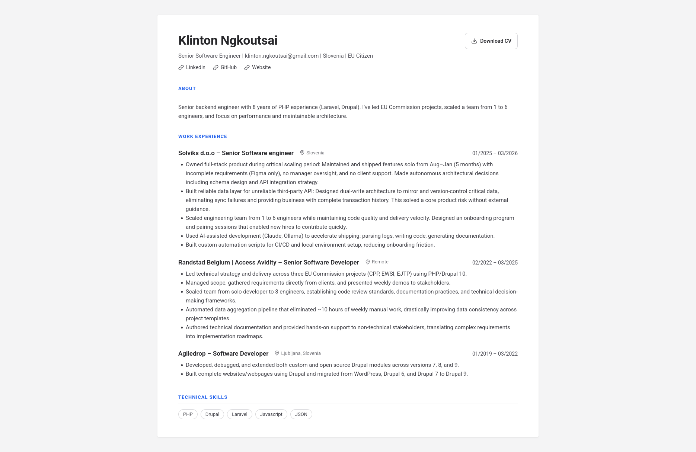
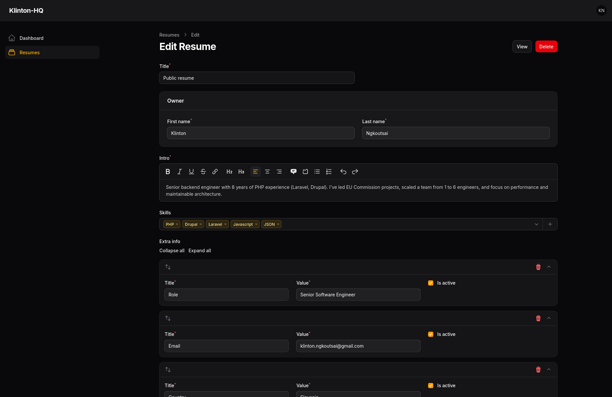

# Klinton HQ

[](https://github.com/ngkoutsaik/klinton-hq/actions/workflows/ci.yml)
[](LICENSE)

**Live site: [klinton.dev](https://klinton.dev/)**

Klinton HQ is my hub as a contractor: a place where people can find out more about me and get in touch, and a set
of tools that automate the time-consuming parts of the job. It's also a project for going deeper into Laravel and
DevOps: Docker, CI, static analysis, and self-hosting with Coolify.

The first tool is a **resume generator**. I keep my resume in an admin panel, the homepage shows the published
version, and visitors can download it as a PDF. Invoicing is planned next.

| Public resume page | Admin panel |
|--------------------|-------------|
| <a href="docs/screenshots/resume.png"></a> | <a href="docs/screenshots/admin.png"></a> |

## Features

- **Public resume page.** The homepage shows the published resume, with skills, work experience, links and extra info.
- **PDF download.** `/download` renders the same page to an A4 PDF through [Gotenberg](https://gotenberg.dev). The
  output is cached and the route is rate limited.
- **Admin panel.** [Filament](https://filamentphp.com) at `/admin` for managing resumes. Only users flagged as admin
  can sign in.
- **SEO.** Open Graph tags, a JSON-LD `Person` schema, `sitemap.xml` and `robots.txt`. The admin panel, the PDF
  download and the "coming soon" page are marked `noindex`.

## Tech stack

- **Laravel 13 (PHP 8.3).** I've used Laravel in production for about a year and a half, so this is a chance to go
  deeper. It's also quick to build and ship with.
- **Filament 5** for the admin panel. This is a standard CRUD site, and Filament saves a lot of development time. The
  trade-off is that it can get complicated in more advanced cases, such as several pivot tables in one form.
- **Gotenberg** (through [spatie/laravel-pdf](https://github.com/spatie/laravel-pdf)) for PDFs. I've used PHP
  libraries like dompdf and mPDF before; they're finicky and struggle with modern CSS, often forcing table-based
  layouts. Gotenberg renders with Chromium, so the PDF uses the same template and CSS as the web page. It's slower
  than a PHP library, but the generated PDF is cached to compensate for that.
- **Coolify on a Hetzner VPS** for hosting (see [Deployment](#deployment)). It's quick and easy, and as my first
  self-hosted deployment I didn't want to write all the scripts from scratch. I'm learning the DevOps side in steps.
- **MySQL** in development, CI and production. The schema is simple and doesn't change much, and I know how MySQL
  works with Laravel.
- **PHPStan, Pint and PHPMD** for code quality, run in CI and on every commit through a GrumPHP pre-commit hook.
- **Laravel Sail, Vite and Tailwind CSS** so I don't have to build everything from zero. Sail gets a local
  environment running quickly, and Vite with Tailwind handles the CSS and assets.

## Where to look

| What                         | Where                                                   |
|------------------------------|---------------------------------------------------------|
| Public routes                | `routes/web.php`                                        |
| Homepage and PDF             | `app/Http/Controllers/HomeController.php`               |
| Sitemap and robots.txt       | `app/Http/Controllers/SeoController.php`                |
| Resume page and PDF template | `resources/views/home.blade.php`                        |
| Admin form                   | `app/Filament/Resources/Resumes/Schemas/ResumeForm.php` |
| Admin panel setup            | `app/Providers/Filament/AdminPanelProvider.php`         |
| Data model                   | `app/Models/`, `database/migrations/`                   |
| Create-admin command         | `app/Console/Commands/CreateAdmin.php`                  |

## Getting started

### Prerequisites

- Docker with Docker Compose

PHP, Composer and Node.js run inside Sail's containers, so you don't need them on the host.

### Setup

```bash
git clone git@github.com:ngkoutsaik/klinton-hq.git
cd klinton-hq

docker run --rm \
    -u "$(id -u):$(id -g)" \
    -v "$(pwd):/var/www/html" \
    -w /var/www/html \
    laravelsail/php83-composer:latest \
    composer install --ignore-platform-reqs

cp .env.example .env
```

The first `composer install` runs in a throwaway container, because Sail itself is installed by Composer.

`.env.example` defaults to SQLite. To use Sail's MySQL container, change the database settings in `.env`:

```dotenv
DB_CONNECTION=mysql
DB_HOST=mysql
DB_PORT=3306
DB_DATABASE=laravel
DB_USERNAME=sail
DB_PASSWORD=password
```

Then start the containers and finish the setup:

```bash
./vendor/bin/sail up -d
./vendor/bin/sail artisan key:generate
./vendor/bin/sail artisan migrate
./vendor/bin/sail npm install
./vendor/bin/sail npm run build
```

The app runs at <http://localhost>. Set `APP_PORT` in `.env` to use a different port.

Sail also starts a Gotenberg container, and `.env.example` already points `GOTENBERG_URL` at it, so PDF downloads
work locally without extra setup.

> [!TIP]
> Use `./vendor/bin/sail npm run dev` instead of `build` for hot reloading while you work. It keeps running until you
> stop it. If you stop it and the page loads without CSS, delete `public/hot` and run `build` again.

### First run

1. Create an admin user:

   ```bash
   ./vendor/bin/sail artisan app:create-admin
   ```

   It asks for an email, name and password. If the email already belongs to a user, it makes that user an admin and
   resets their password.
2. Set `DEFAULT_ADMIN_EMAIL` in `.env` to that same email. The public pages show this user's resume.
3. Sign in at <http://localhost/admin>.
4. Create a resume and tick **Published**.
5. Open <http://localhost>. The download button gives you the PDF.

> [!NOTE]
> The homepage shows the published resume of the user whose email matches `DEFAULT_ADMIN_EMAIL`. Until that user has
> a published resume, `/` shows a "coming soon" page and `/download` and `/sitemap.xml` return 404. If
> `DEFAULT_ADMIN_EMAIL` is empty, those three routes fail with an "Admin email is not set" error.

## Testing and code quality

Run these through Sail, e.g. `./vendor/bin/sail composer test`. The tests use Sail's MySQL `testing` database.

```bash
composer test      # PHPUnit
composer lint      # composer validate, Pint (check only), PHPMD
composer analyse   # PHPStan (Larastan)
composer fix       # Apply Pint fixes
composer check     # Run GrumPHP on the whole project, the same checks as CI
```

GrumPHP runs as a pre-commit hook inside the Sail container, so Sail needs to be running when you commit. It checks
only the staged files with Pint, PHPMD and PHPStan, and blocks leftover debug calls like `dd()`.

GitHub Actions runs on every push and pull request to `main`: GrumPHP on the whole project, the tests on
MySQL 8.4 (after the front-end build), `composer audit` and `npm audit`, and a build of the production Docker image.

## Deployment

### How klinton.dev runs

- A [Hetzner](https://www.hetzner.com) VPS running [Coolify](https://coolify.io), with Traefik handling routing and
  HTTPS.
- The app is built from the `Dockerfile` in this repo.
- MySQL and Gotenberg are Coolify-managed services on the same Docker network, so the app reaches them by their
  service names.
- I merge pull requests into `main` once GitHub Actions passes. Every push to `main` triggers a webhook that makes
  Coolify rebuild and deploy the app; the deployment waits for CI to pass.
- To create an admin in production, run `php artisan app:create-admin` from the app container's terminal in Coolify.

### Running it yourself

The `Dockerfile` builds a production image based on
[serversideup/php](https://serversideup.net/open-source/docker-php/) (PHP-FPM and Nginx). It installs Composer
dependencies without dev packages, builds the front-end assets and caches Filament's assets. With
`AUTORUN_ENABLED=true`, the container runs the Laravel startup tasks (such as migrations and caching) on boot.

```bash
docker build -t klinton-hq .
docker run -d --name klinton-hq --env-file .env.production -p 8080:8080 klinton-hq
```

You need to provide:

- A production env file with `APP_ENV=production`, `APP_DEBUG=false`, a generated `APP_KEY`, the database settings
  and `DEFAULT_ADMIN_EMAIL` (the admin whose resume the site shows).
- A running **Gotenberg** instance, set with `GOTENBERG_URL` (e.g. `http://gotenberg:3000`). PDF generation needs it,
  and `/download` fails without it. The rest of the site works fine.

Create the first admin inside the running container, using the same email as `DEFAULT_ADMIN_EMAIL`:

```bash
docker exec -it klinton-hq php artisan app:create-admin
```

## Roadmap

- [x] Resume page with PDF download
- [x] Open Graph tags and structured data
- [ ] Social preview image (`og:image`)
- [ ] Education and certifications
- [ ] Contact form with spam protection
- [ ] Private links to tailored resumes
- [ ] Invoicing: clients, invoices, PDF, email sending

## Contributing

This is a personal project, so I'm not looking for pull requests. Issues and suggestions are welcome, though.

## Security

Please don't open a public issue for security problems. Report them privately through GitHub's
[security advisories](https://github.com/ngkoutsaik/klinton-hq/security/advisories/new) instead.

## Contact

The best way to reach me is through [klinton.dev](https://klinton.dev/).

## License

[MIT](LICENSE). You can use, change and share the code however you like, with no warranty and no liability on my
part.

> [!IMPORTANT]
> This includes the invoicing features. Invoicing rules (numbering, required fields, tax, e-invoicing) differ by
> country, and nothing here is legal or tax advice. If you use this code to issue invoices, you're responsible for
> checking that they meet your local requirements.
